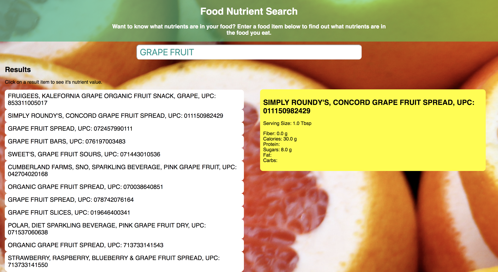

# README #

## Nutrient App ##
The [Nutrient App](https://hannah-rogers.github.io/Nutrient_App/) lets you search the USDA Nutrient Database to find the nutrient values of the foods you eat. It utilizes ajax to search the database.

### Key Technologies ###
* HTML
* CSS
* JavaScript
* jQuery

### Screenshots ###

